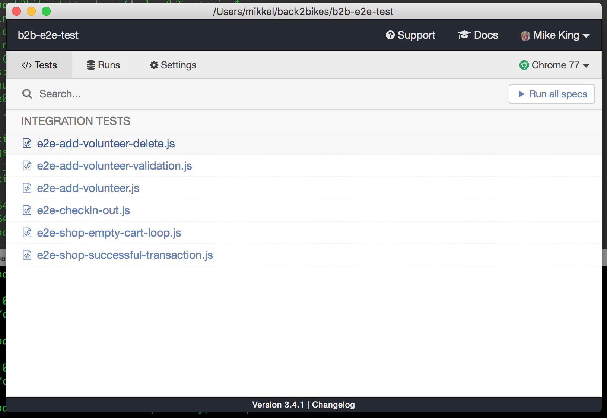

# b2b-e2e-test

End to end testing of attendance app (in a separate repo)

## Getting started

### Pre-requisites

- Chrome Browser
- iTerm 2 (Mac only)
- NodeJS version 10.16 https://nodejs.org/en/
- Git version control https://git-scm.com/downloads
- Git bash (comes with Git above)
- Visual Studio Code editor https://code.visualstudio.com/download
  - Plugin Chrome Dev Tools
  - Prettier
- Beyond Compare (optional but recommended) https://www.scootersoftware.com/download.php

### Download and setup

Open up a command shell, either iTerm on Mac, or powershell or git-bash on Windows

```bash
git clone https://github.com/Back2bikes/b2b-e2e-test.git
cd b2b-e2e-test
npm i
```

At this stage you are ready for action. You can run the tests using the following command line:

```bash
npm run cypress:open
```

This will open up a Cypress window, which will look like this



Any of these tests can be run by clicking on them, at which stage a Chrome window will open, and step through the test.

## Running tests in headless mode

You can run the test suite without opening windows, using the command:

```
npm run cypress:run
```

This runs quicker than using the browser, and sends output to the terminal, which looks like this:


## Project folder structure

```
(project-root)
 cypress.json  - configuration file
 |
 \ tests
  |
   \ cypress
    |
    \ integration
     |
     \ main    - Main tests
     |
     \ shop    - Tests for Peak Adventure Shop
```

## Writing tests

Writing and developing tests is pretty easy, as Cypress does most of the hard work behind the scenes, like waiting for the page to render, and elements to appear.

Tests are written in functional Javascript, which is pretty easy to understand. Here is some sample code:

```javascript
describe('Create member', () => {
  it('Open form - about you', () => {
    cy.visit('/') // The starting point (relative to the baseUrl)
    cy.get('#add_member') // Find an element by id
      .click() // and click it
    cy.get('div')
      .contains('About You') // Find a div containing 'About You'
      .should('exist') // Further test
    // Nothing mandatory on the first page, so just click 'Next'
    cy.get('button')
      .contains('Next')
      .click()
  })
})
```

## Target system

This suite has the Back2bikes staging server, https://staging.back2bikes.com.au/ as it's default target.

Configuration can be modified in cypress.json, but usually it is better to achieve a temporary change using the command line like this:

`npm run cypress:open -- --config baseUrl=http://localhost:3030`

## Further reading

https://docs.cypress.io/guides/overview/why-cypress.html#In-a-nutshell

https://docs.cypress.io/guides/overview/why-cypress.html#In-a-nutshell
